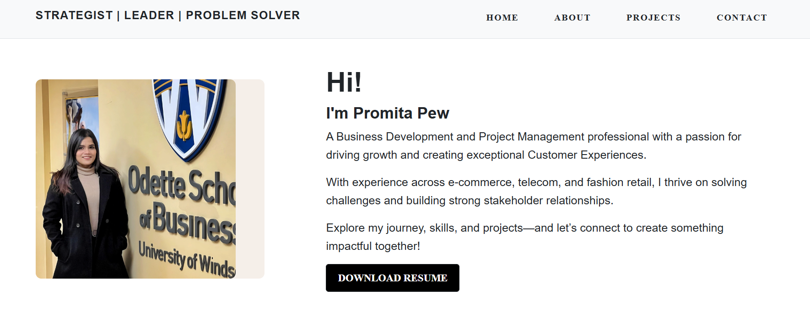

# Portfolio Website

A modern and responsive portfolio website showcasing my professional journey, skills, and projects. This website is designed to make an impact and serve as an online presence for potential collaborators, recruiters, and clients.

---

## Features

- **Responsive Design**: Optimized for both desktop and mobile devices.
- **Projects Showcase**: Highlighting key projects with detailed descriptions and visuals.
- **Contact Section**: Easy-to-use contact options with email and social media links.
- **Minimalistic Design**: Clean and professional layout with a focus on content.

---

## Technologies Used

- **HTML5**: For the structure of the website.
- **CSS3**: For styling and layout.
- **GitHub Pages**: For hosting the live website.

---

## Live Demo

The website is live and accessible at:
[Portfolio Website](https://promitapew.github.io/portfolio-website/)

---
